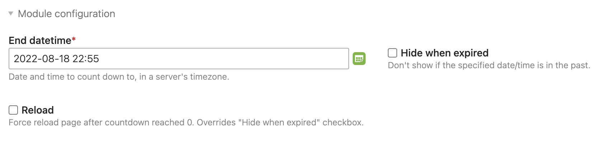

# Countdown extension for Contao 4 CMS

## Install

Install with composer as usual:

```bash
composer install ameotoko/contao-countdown
```


## Description

The extension provides a content element and a frontend module for [Contao CMS][1], which allow you quickly set up and show a countdown widget on your website.

The widget itself is beautifully designed and developed by [@pqina][2]. Check out the widget's [website][3].

[](https://pqina.nl/flip)


## Current limitations

The extension primarily serves the needs of my own projects, so there's not much room for customization at the moment. However, I do plan to add more settings in the future.


## Usage

After installation, you can add a "Countdown" content element or a frontend module in the back end. They both have same three settings:



**End datetime**

This is the point in time to count down to. This is set in your server's timezone, but converted to UTC under the hood, meaning – all your visitors from different timezones will see exactly the same time left to D-Day. If it's 1 hour left for you – it's the same 1 hour left for your visitor on the other side of the world, that looks at your site at the same time.

**Hide when expired**

When checked, the widget will disappear from the page when it reaches zero, without reloading the page, and it will not appear on any subsequent page load. If you need to show your visitors, that they missed something great – do not check this box, and they will see all zeros!

**Reload**

If checked, the page will refresh itself upon reaching zero on the countdown. Typical use-case:

1. Create some content with `show until = 23:59:59`
2. Create some other content with `show from = 00:00:00`
3. Set countdown to `00:00:00` with `reload` checked
4. Go to bed
5. Even if your visitors keep stare at the screen at midnight, they will see old content disappear and new content show up at midnight
6. ??????
7. PROFIT

---

Contao is an Open Source PHP Content Management System for people who want a
professional website that is easy to maintain. Visit the [project website][1]
for more information.

[1]: https://contao.org
[2]: https://pqina.nl
[3]: https://pqina.nl/flip
